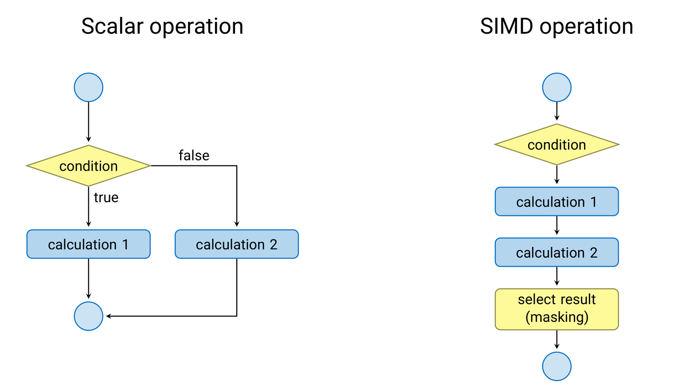
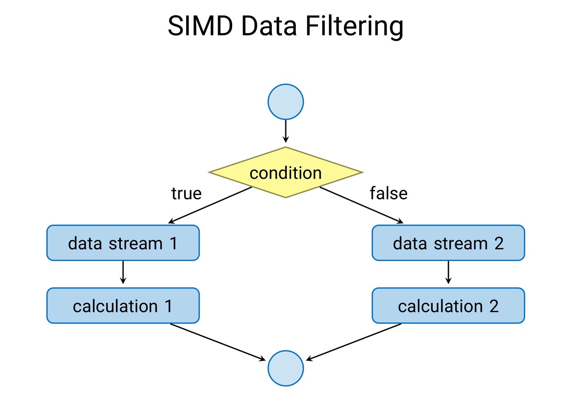
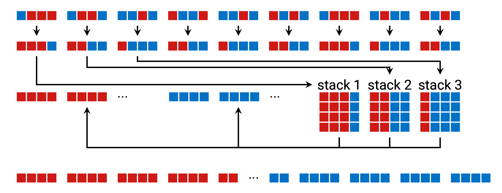

# A technique for improving vectorization without masking

One of the main challenges in order to achieve high performance on modern
processors is to effectively use SIMD instructions to vectorize loops and
kernels.

When different operations must be performed according to a set of conditions on
a scalar processor, it first computes the condition, then jumps to the right
place and performs only the operations for that particular condition. On the
other hand, in SIMD vectorized code, all lanes must perform similar work.
Therefore, when there is branching, the usual procedure is to compute both
branches, then use a mask representing the set of conditions to combine the
answers and obtain the final result.



When one of the branches is empty, it is common to refer to SIMD lanes
as being active, that is, doing useful work, or inactive, doing work
that will be discarded by the mask when assigned. If most of the time
the SIMD lanes are active, then the gain by vectorization is close to
the theoretical limit (4x in the case of double precision operations
using AVX2, for example). However, if the number of inactive lanes
increases for any reason, then there is a lot of computational work that
is discarded, which means that the gain in performance by vectorization
is reduced.

In ray tracing, for example, it is possible to vectorize ray casting against the
geometry by processing rays in packets with the same number of rays as the
number of SIMD lanes. However, when there are reflections, and during the
traversal of the bounding volume hierarchy (BVH), packets of rays take paths to
diverging subtrees of the BVH. In other words, the rays become decoherent, and
can no longer be processed in packets. What happens is that rays need to be
tested against different triangles, located at different subtrees of the BVH.
If we imagine the BVH is implemented as a binary space partitioning tree (BSP
tree), then it may make sense to separate all rays that need to be processed by
each subtree to be processed together in the next iteration, so that most SIMD
lanes can continue to be active, even when rays are not coherent. This is
accomplished by shuffling ray data in such a way as to group decoherent ray
packs back into fully coherent packs.

This technique can also be applied in high energy physics simulation software,
which is similar to ray casting in many aspects. The idea in the case of
[Geant](doc/GeantV.md), however, is to regroup particle tracks in the detector
by type, or by detector volume, to be able to exploit vectorization of basic
algorithms (geometry queries and physics models) as much as possible, while
filtering out tracks for which the given operation doesn't apply. An example
is filtering out all leptons from the loop that computes the contribution from
hadronic models (e.g. nuclear reactions), or filtering out lanes with uncharged
particles from the loop that does the expensive trajectory integration in a
magnetic field.

# Filtering using AVX2 instructions

The filtering technique to regroup mixed active/inactive SIMD lanes into two
streams (one with only active, one with only inactive lanes) is quite simple:
for each SIMD group, sort the vector using the mask of active/inactive lanes
such that all active lanes are pushed to one side and all inactive lanes to the
other. Then, according to the number of active lanes, push the vector to a
different stack. When each stack becomes full, the data on the stack is
transposed and added into the appropriate data stream. The stream with active
lanes can process the data, while the stream with inactive lanes skips the
operation entirely, or performs a different operation. The key difference with
masking is that only one of the branches determined by the mask needs to be
computed in each *data stream*, while *SIMD lanes* in each stream perform
identical work, which improves vectorization effectiveness by not wasting work
on lanes where the mask is false, since all these are filtered into another
stream.



The algorithm to sort the SIMD lanes is the heart of this filtering technique.
By using a single vector instruction type, it avoids performance loss from
fetching and decoding, which means that the full filtering is actually a
lightweight operation. The function that performs this sorting uses a hard-coded
sorting network of 4 elements. The variable `shtab` below contains a code of
which of four operations to perform: swapping of pairs of elements (ABCD →
CDAB), swapping of consecutive elements (ABCD → BADC), swapping of the two
elements in the middle (ABCD → ACBD), and a cross-product swap (ABCD → BCAD).
The code is fetched using the mask, which has value between 0 and 15.

## Table of suffles for sorting network

The letters C, M, I, O, below represent, respectively, a cross swap, and a swap
of mid, inner, outer pairs. The value is either true or false for each mask if
the operation must be performed or not, and the order of application is from
right to left. For example, for mask value 9 (1001), lanes are organized by
first performing an outer pair swap (1001 → 0110), then a cross swap (0110 →
0011); for mask value 10 (1010), lanes are sorted by first performing an inner
pair swap (1010 → 0101), then a mid pair swap (0101 → 0011). Each mask sorting
operation can be easily validated this way using the table below.

Value | Mask | CMIO | Code | 1s sorted to LSbs |
:----:|:----:|:----:|:----:|:------:|
    0 | 0000 | FFFF |    0 |  0000  |
    1 | 0001 | FFFF |    0 |  0001  |
    2 | 0010 | FFTF |    2 |  0001  |
    3 | 0011 | FFFF |    0 |  0011  |
    4 | 0100 | FFFT |    1 |  0001  |
    5 | 0101 | FTFF |    4 |  0011  |
    6 | 0110 | TFFF |    8 |  0011  |
    7 | 0111 | FFFF |    0 |  0111  |
    8 | 1000 | FFTT |    3 |  0001  |
    9 | 1001 | TFFT |    9 |  0011  |
   10 | 1010 | FTTF |    6 |  0011  |
   11 | 1011 | FFTF |    2 |  0111  |
   12 | 1100 | FFFT |    1 |  0011  |
   13 | 1101 | FFFT |    1 |  0111  |
   14 | 1110 | FFTT |    3 |  0111  |
   15 | 1111 | FFFF |    0 |  1111  |

## AVX2 sorting algorithm using sorting network table

The function below uses the table above to implement the sorting of SIMD lanes
based on the mask. Notice that the value of the `shtab` variable is composed of
the codes from the table above taken from top to bottom and placing them from
left to right into a 64 bit integer. If the code is 0, when the mask is already
sorted, we return early; otherwise, we perform at most two out of the four kinds
of shuffling operations to get the lanes sorted with data from active SIMD lanes 
(marked 1 in the mask) pushed into the least significant bits of the SIMD vector.

```cpp
void _mm_sort_pd(__m256d& mm, const uint8_t& mask)
{
    const uint64_t shtab = 0x311269308410200;
    uint8_t code = (uint8_t)((shtab >> 4*mask) & 0x0f);
    if (code == 0) return;
    if (code & 1) mm = _mm256_permute4x64_pd(mm, 0x4e);
    if (code & 2) mm = _mm256_permute4x64_pd(mm, 0xb1);
    if (code & 4) mm = _mm256_permute4x64_pd(mm, 0xd8);
    if (code & 8) mm = _mm256_permute4x64_pd(mm, 0x39);
}
```

## Proof of concept

The figure below shows the whole process. The function above performs the
first and most crucial step. Then, based on the number of active lanes,
the vectors are pushed to stacks that are then transposed when they become
full, so 4 mixed vectors become a combination fully active or fully inactive
vectors, which can then be processed with full utilization of SIMD lanes.



When several branches exist, and each of them is expensive (think, for example,
about a physics models that applies only for certain particles, like electrons
and photons), then the work to regroup the data as shown above is smaller than
the gain from vectorization, which leads to an overall speedup.

In the case of ray tracing and high energy physics simulations, the indices to
each ray or particle track (stored in SoA layout) can be the data to be
processed, and then coherent rays, or tracks corresponding to electrons, can be
selected with the data filter to be processed in a vectorized way using gather
instructions such that all SIMD lanes are always active, wasting no work.

This idea is still under development for use with GeantV, so what we provide
here is a simple proof of concept to demonstrate that this technique is actually
effective. The code sample in this example uses double precision data, and
processes a random stream of double precision numbers in the interval [-1,1] by
applying two different functions *f()* and *g()* on negative and positive
numbers, respectively. Each function is simply a wasteful version of the
identity function, to allow for easy inspection of the output. To run the code,
just do the following (in the directory where this file resides):

```
$ mkdir build
$ cd build
$ cmake ..
$ make
$ make test
$ # use command below see a text output of the filtering in action
$ cat Testing/Temporary/LastTest.log
```

You should see that the sorting technique is faster than masking.

