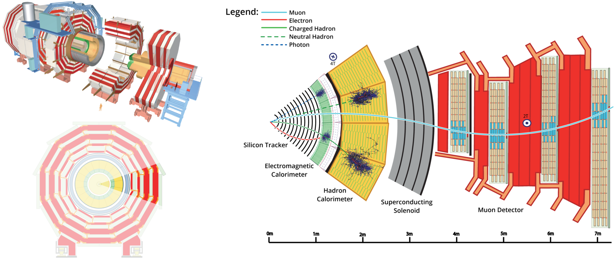

# The Geant simulation tookit

## Introduction

Intel's Parallel Computing Center (PCC) project at UNESP (São Paulo State
University) is dedicated to code modernization of simulation software used by
the high energy physics community. We participate in the development of the next
generation of the Geant simulation toolkit, GeantV.  Geant [1] is a toolkit for
the simulation of the passage of particles through matter and the interactions
they undergo along the way. It is used by high energy physics (HEP) and nuclear
physics experiments to generate simulated collision events in order to compare
theoretical models with experimental data.  It is used at the LHC by ATLAS, CMS,
ALICE, and LHCb, and by other experiments, such as BaBar, at SLAC, and KEK, in
Tsukuba, Japan. Geant is also used in other contexts, such as in space research,
to simulate radiation environments that electronics systems and astronauts have
to endure, and in medical applications, to model radiation interactions used for
the treatment of diseases such as cancer.

## Brief history of Geant

The history of Geant dates back to 1974, when the first version was developed at
CERN [2]. The name Geant comes from GEometry ANd Tracking of high energy
elementary particles through matter (such as a detector). The first version of
GEANT3 was released in 1982 and was written in Fortran. Geant4, the current
production version of Geant, is a complete rewrite of GEANT3 in C++.  Geant4 has
been built upon many years of experience as well as on a large amount of data
collected in experiments. Its development began in 1994, long before C++ had
support for templates and other advanced features.  Therefore, its code was
single-threaded until recently, when the multi-threaded Geant4MT was announced [3].

## Need for code modernization

Experiments at the LHC have an ever increasing demand for simulated collision
events, which play a key role in HEP data analysis. Each physics analysis needs
to compare several theoretical models that attempt to explain the observed data,
and each model requires the simulation of many events to gather enough
statistics in order to reduce uncertainty. Although the simulation of multiple
events is an embarassingly parallel problem, Geant's long history goes back far
enough that at the time multi-processing was not yet common. Geant4MT allows the
simulation of whole events in parallel using multiple threads, one for each
event. However, a drawback of this approach is that, at high energies, collisions
tend to generate a large number of secondary particles from interactions between
the primary collision products and the materials that make up the sensitive
detector volumes. Since each collision event is still simulated serially, these
secondary particles accumulate in memory awaiting their turn to be processed,
greatly increasing memory comsumption as the number of threads increases.
Therefore, in order to leverage the full capabilities of highly parallel modern
hardware such as graphics processing units and the Xeon Phi™ coprocessor—which
have a relatively low amount of high-bandwidth memory—a full redesign of the
simulation toolkit has become a necessity. Not only are the beam energy and
intensity going to increase for the next runs at the LHC—which will increase
the amount of data to be analyzed, and, consequently, data to be simulated—but
funding for additional hardware becomes increasingly difficult to justify if the
software cannot leverage the extra compute power using finer grained parallelism
such as vectorization and multi-threaded processing of each event.

## The GeantV project

The GeantV project began as a collaboration between CERN and Fermilab to develop
a new, high-performance simulation toolkit redesigned to leverage new forms of
parallelism offered by highly parallel hardware. GeantV is intended as a future
replacement for Geant4 after it becomes mature enough to simulate the main
experiments at the LHC. Thanks to Intel, UNESP has been able to join this code
modernization effort to collaborate in the redesign and development of the new
software.

## Overview of a Geant Simulation

Geant is a toolkit for the simulation of the passage of particles through
matter. In a sense, a Geant simulation is similar to a ray tracing simulation.
The overall setup consists of an event generator (light source), that creates
particles (rays, or tracks, in Geant terminology) to be traced trough the
detector geometry (scene), and a set of physics models for the interactions that
the particles can undergo (lighting model). However, despite all of the
similarities with ray tracing, there are some key differences that set the two
kinds of simulations apart. For example, in ray tracing each light ray follows a
straight line, and simply bounces off of surfaces until its path finally reaches
the camera. The lighting model is then used to determine the color of each pixel
in the projection plane. Although photons also follow a straight line in Geant,
charged particles may not, if an electromagnetic field is present. Moreover,
although photons follow a straight line, in a Geant simulation they can
participate in physical processes not present in ray tracing. For example,
photons can knock out electrons off an atom in the detector, they can create
particle and anti-particle pairs (e.g., a positron and an electron), they can
scatter off a nucleus elastically or inelastically, etc.  Each kind of physics
process also has a different probability to happen according to the material in
which the particle is embedded, the particle's type, energy, etc. In addition to
photons, Geant also needs to simulate many other particle types such as leptons,
hadrons, etc, and their processes. Most of the particles are extremely unstable
and decay into other particles after traveling a short distance inside the
detector, even if they do not otherwise interact.

In a ray tracing rendering, the user provides the ray tracer a description of
the scene that should be rendered, the position of light sources, their color,
and the position of the camera, as well as the resolution of the final image.
In Geant, the input consists of a description of the geometry of the detector
through which the particles will be traced, a sequence of events to be
simulated, and the output is the final energy deposits on each sensitive volume
of the detector and their time from the beginning of the event. The energy
deposits are called _hits_ in Geant terminology (_digits_ after some
post-rocessing). The output of a Geant simulation in form of hits or digits is
then post-processed by other software in order to simulate the electronics
system that performs data aqcuisition in the real experiments. The end result
are data sets in the same format as those generated by the experiments
themselves. Physicists then analyze both kinds of data sets in the same way,
usually using the ROOT [4] data analysis framework. In GeantV, ROOT is mainly
used for parallel I/O, and for plotting performance data while a simulation is
running.

The sequence of events that is part of the input for Geant is also produced by
other software, e.g. Pythia [5]. Each _event_ in Geant corresponds to the
simulation of the trajectories and interactions of an initial set of particles
that resulted from a proton–proton collision in an LHC experiment and the many
byproducts of the primary particles. For the sake of illustration, in a medical
application, rather than events, the user might have as part of the input a
particle gun that shoots particles into a model of human tissue, and the output
might be a function that gives a measure of the radiation dose per unit depth.
In high energy physics simulations, event generators generally take input in the
form of a Feynman diagram and generate random sets of product particles from
that process with the appropriate energy and angular distributions that are then
traced through the detector by the simulation software. For instance, one might
want to study the decay of a Higgs boson into two photons, in which case the
energy and directions of the two photons product of the decay would be the input
for each event in Geant. The point at which such an interaction or decay happens
is usually called a _vertex_. Since protons are colliding at a rate of about 40
MHz at the LHC, several vertices may be present in an event measured in the
experiments. This pile-up effect must also be simulated in Geant. Due to the
high rate of collisions, LHC experiments only trigger data acquisition for a
fraction of the events. In CMS, there are two levels of trigger: L1, which is a
fast hardware trigger, and the HLT (high level trigger), which is a software
trigger. Triggers are based on the types of particles produced in an event,
their energy, direction, etc, so there is some data analysis performed online by
the experiment in order to be able to decide if an event should be saved or not.

The other essential part of the simulation is the description of the detector
geometry. In order to be able to exchange such descriptions between different
simulation toolkits, physicists have developed an XML-based markup language
called Geometry Description Markup Language (GDML) [6]. In this language, it is
possible to define material properties for detector volumes and the geometric
hierarchy of volumes can be constructed from a set of supported base volume
types using constructive solid geometry. Both ROOT and Geant4 have an
implementation of a GDML reader, and an implementation is currently being
developed for VecGeom. In the future, this is most likely going to be the
standard input file format for GeantV.

### References

1. [Geant4](http://ieeexplore.ieee.org/xpls/abs_all.jsp?isnumber=33833&arnumber=1610988&count=33&index=7&tag=1)
2. [GEANT: user guide and reference manual](https://cds.cern.ch/record/118715)
3. [A Roadmap For Geant4](http://iopscience.iop.org/1742-6596/396/5/052007/pdf/1742-6596_396_5_052007.pdf)
4. [ROOT](http://root.cern.ch)
5. [Pythia](http://home.thep.lu.se/~torbjorn/Pythia.html)
6. [GDML](http://gdml.web.cern.ch/GDML)
